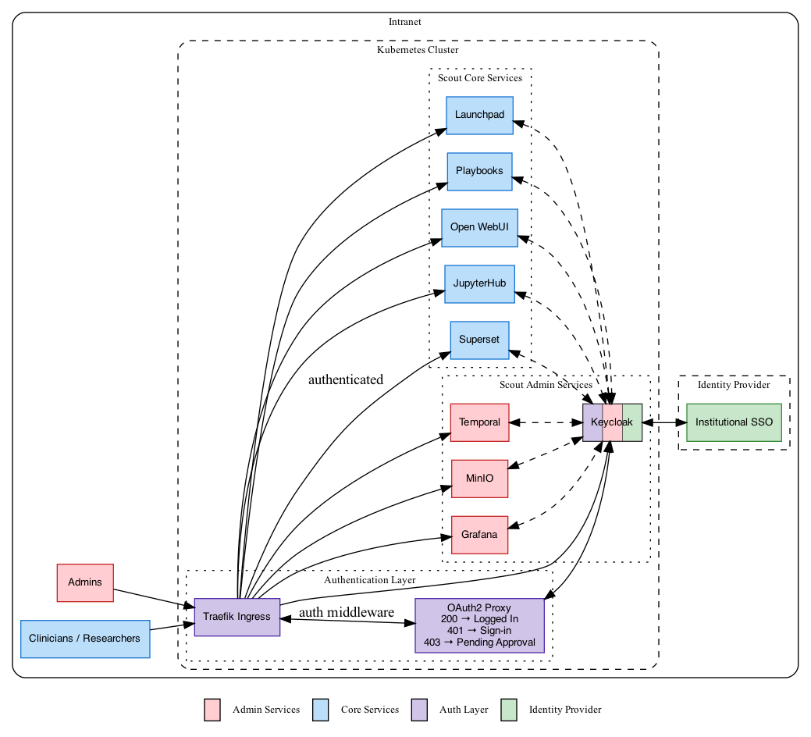

# Scout Authentication & Authorization

This document provides technical details about Scout's authentication and authorization system.

## Table of Contents

- [Architecture Overview](#architecture-overview)
  - [Authentication Flow](#authentication-flow)
  - [Subdomain Routing](#subdomain-routing)
  - [Middleware Stack](#middleware-stack)
- [Components](#components)
  - [Keycloak](#keycloak)
  - [OAuth2 Proxy](#oauth2-proxy)
- [Service Integrations](#service-integrations)
- [Roles & Permissions](#roles--permissions)
  - [Groups](#groups)
  - [User Approval Workflow](#user-approval-workflow)
- [Configuration](#configuration)
  - [Required Inventory Variables](#required-inventory-variables)
  - [Optional Configuration](#optional-configuration)
  - [Post-Deployment Configuration](#post-deployment-configuration)
- [Testing](#testing)
  - [Curl Tests](#curl-tests)
  - [Playwright Browser Tests](#playwright-browser-tests)

## Architecture Overview

Scout's authentication system uses a multi-layered approach combining Keycloak (identity provider), OAuth2 Proxy (authentication middleware), and service-specific OAuth/OIDC integrations.



### Authentication Flow

**First-time authentication:**

1. **User Access**: User requests a Scout service through Traefik ingress
2. **OAuth2 Proxy Check**: Traefik middleware redirects unauthenticated requests to OAuth2 Proxy
3. **Keycloak Authentication**: OAuth2 Proxy redirects to Keycloak for login
4. **Identity Provider**: Keycloak authenticates against configured institutional identity provider
5. **User Registration Check**: OAuth2 Proxy verifies user has the `oauth2-proxy-user` role (inherited from `scout-user` group)
6. **Service Access**: OAuth2 Proxy forwards the request to the target service
7. **Service Authentication**: Service validates user identity and roles with Keycloak OAuth/OIDC

**Subsequent requests:**

For authenticated users in the `scout-user` group, OAuth2 Proxy validates its session cookie and forwards the request. Each service then validates its own session cookie/token internally without needing to re-authenticate with Keycloak.

### Subdomain Routing

Scout services are accessed via subdomains. Each ingress is configured in Traefik and protected by OAuth2 Proxy middleware:

| Subdomain | Service | Protected by OAuth2 Proxy |
|-----------|---------|----------------------------|
| `{server_hostname}` | Launchpad | Yes |
| `superset.{server_hostname}` | Superset analytics | Yes |
| `jupyter.{server_hostname}` | JupyterHub notebooks | Yes |
| `grafana.{server_hostname}` | Grafana monitoring | Yes |
| `temporal.{server_hostname}` | Temporal workflow UI | Yes |
| `minio.{server_hostname}` | MinIO console | Yes |
| `chat.{server_hostname}` | Open WebUI (optional) | Yes |
| `playbooks.{server_hostname}` | Voila Playbooks (optional) | Yes |
| `auth.{server_hostname}` | OAuth2 Proxy | No* |
| `keycloak.{server_hostname}` | Keycloak admin console | No* |
| `*.{server_hostname}` | Catch-all | Yes (Redirect to Launchpad) |

*OAuth2 Proxy and Keycloak endpoints must remain publicly accessible for authentication and OAuth/OIDC flows.

### Middleware Stack

Traefik middlewares enforce authentication:
1. **oauth2-proxy-auth**: Forwards auth requests to OAuth2 Proxy for validation
2. **oauth2-proxy-error**: Redirects 401 errors to OAuth2 Proxy sign-in

Applied to services via ingress annotations:
```yaml
traefik.ingress.kubernetes.io/router.middlewares: >
  kube-system-oauth2-proxy-error@kubernetescrd,
  kube-system-oauth2-proxy-auth@kubernetescrd
```

Add this middleware stack to any new service ingress to enable authentication with OAuth2 Proxy.

## Components

### Keycloak

**Role**: Centralized identity and access management

**Key Features**:
- Single Sign-On (SSO) across all Scout services
- Integration with external institutional identity providers
- Role-based access control (RBAC)
- User approval workflow via email notifications
- Custom Scout realm configuration

**Deployment Details**:
- Uses Keycloak Operator for Kubernetes deployment
- PostgreSQL backend for persistence
- Custom Scout email event listener for user approval notifications
- [Keycloak Config CLI](https://github.com/adorsys/keycloak-config-cli) for realm import and configuration

### OAuth2 Proxy

**Role**: Authentication middleware and user registration gatekeeper

**Key Features**:
- Checks if users have been approved (added to `scout-user` group in Keycloak)
- Redirects unauthenticated users to Keycloak sign-in
- Redirects unauthorized users to pending approval page

## Service Integrations

Scout uses two layers of authentication. **OAuth2 Proxy** acts as a gatekeeper at the Traefik ingress layer ensuring only approved users (those in the `scout-user` group) can reach any service. Behind that gate, **each service maintains its own Keycloak OAuth/OIDC client** to establish the user's identity and roles within that service.

This double authentication exists because most services need more than a pass/fail access check, needing to know _who_ the user is and what roles they have. Ideally services would read this from headers set by OAuth2 Proxy, but most services require their own OAuth client to populate their internal user and role models. The result is that a user authenticates with Keycloak twice on first access to a service: once through OAuth2 Proxy (ingress), and once through the service's own OAuth flow.

## Roles & Permissions

### Groups and Client Roles

Keycloak groups automatically assign client-specific roles for each service:

**`scout-admin` group assigns these client roles**:
- OAuth2 Proxy: `oauth2-proxy-user` (required for any Scout access)
- Launchpad: `launchpad-admin` (admin view with all services)
- JupyterHub: `jupyterhub-admin`
- Superset: `superset_admin`
- Grafana: `grafana-admin`
- Temporal: `temporal-system:admin`, `default:admin`
- Open WebUI: `open-webui-admin` (if enabled)
- Keycloak: `realm-admin` (realm management permissions)

**`scout-user` group assigns these client roles**:
- OAuth2 Proxy: `oauth2-proxy-user` (required for any Scout access)
- Launchpad: `launchpad-user` (standard user view)
- JupyterHub: `jupyterhub-user`
- Superset: `superset_alpha`, `superset_sql_lab`
- Open WebUI: `open-webui-user` (if enabled)

**Authentication Flow**:
1. User authenticates via OAuth2 Proxy → checks for `oauth2-proxy-user` client role
2. User accesses specific service → service checks for its own client roles
3. All client roles are mapped to the `groups` claim in JWT tokens via the `microprofile-jwt` scope

**Note**: Scout uses Keycloak groups to assign client roles. Always add users to the `scout-user` group for standard access, and to the `scout-admin` group for elevated admin access instead of assigning client roles directly.

### User Approval Workflow

New users must be approved by an admin before accessing Scout services:

1. **New User Login**: User authenticates via institutional identity provider
2. **Account Creation**: Keycloak creates user account
3. **Pending State**: User has no roles assigned and cannot access services
4. **Admin Notification**: Email sent to admins (via custom event listener)
5. **Admin Action**: Admin assigns user to `scout-user` (and optionally the `scout-admin`) group
6. **Access Granted**: User receives email notification and can access services

See [Post-Deployment Configuration](#post-deployment-configuration) for first-time bootstrap steps.

## Configuration

### Inventory Variables

All secrets must be defined in your inventory file and should be vault-encrypted for production deployments.

**Keycloak Admin Console Credentials**:
```yaml
keycloak_bootstrap_admin_user: admin
keycloak_bootstrap_admin_password: $(openssl rand -hex 16 | ansible-vault encrypt_string --vault-password-file vault/pwd.sh)
keycloak_postgres_password: $(openssl rand -hex 32 | ansible-vault encrypt_string --vault-password-file vault/pwd.sh)
```

**Keycloak Identity Provider**:
Select and configure an identity provider for Keycloak to authenticate against. Scout currently provides configuration support for GitHub and Microsoft.

```yaml
# GitHub
keycloak_default_provider: github
keycloak_gh_client_id: 'your-github-client-id'
keycloak_gh_client_secret: 'your-github-client-secret'

# Microsoft
keycloak_default_provider: microsoft
keycloak_microsoft_client_id: 'your-microsoft-client-id'
keycloak_microsoft_client_secret: 'your-microsoft-secret'
keycloak_microsoft_tenant_id: 'your-tenant-id'
```

For development deployments, you can create a new OAuth app in in Github for Keycloak to use:
https://github.com/organizations/your-org-here/settings/applications

Other Keycloak-supported identity providers can be added in the future. Each provider has different required configuration fields (e.g., Microsoft requires a `tenant_id` beyond the standard `client_id` and `client_secret`), so adding new providers could require additional inventory variables.

**Keycloak Client Secrets** (one for each Scout service):
```yaml
keycloak_oauth2_proxy_client_secret: $(openssl rand -hex 16 | ansible-vault encrypt_string --vault-password-file vault/pwd.sh)
keycloak_superset_client_secret: $(openssl rand -hex 16 | ansible-vault encrypt_string --vault-password-file vault/pwd.sh)
keycloak_jupyterhub_client_secret: $(openssl rand -hex 16 | ansible-vault encrypt_string --vault-password-file vault/pwd.sh)
keycloak_grafana_client_secret: $(openssl rand -hex 16 | ansible-vault encrypt_string --vault-password-file vault/pwd.sh)
keycloak_temporal_client_secret: $(openssl rand -hex 16 | ansible-vault encrypt_string --vault-password-file vault/pwd.sh)
keycloak_minio_client_secret: $(openssl rand -hex 16 | ansible-vault encrypt_string --vault-password-file vault/pwd.sh)
keycloak_launchpad_client_secret: $(openssl rand -hex 16 | ansible-vault encrypt_string --vault-password-file vault/pwd.sh)
```

**OAuth2 Proxy Secrets**:
```yaml
oauth2_proxy_cookie_secret: $(openssl rand -hex 16 | ansible-vault encrypt_string --vault-password-file vault/pwd.sh)
oauth2_proxy_redis_password: $(openssl rand -hex 16 | ansible-vault encrypt_string --vault-password-file vault/pwd.sh)
```

**Launchpad NextAuth Cookie Secret**:
```yaml
launchpad_nextauth_secret: $(openssl rand -hex 32 | ansible-vault encrypt_string --vault-password-file vault/pwd.sh)
```

**SMTP for Email Notifications**:
For production deployments, configure SMTP settings for Keycloak to send email notifications:
```yaml
keycloak_smtp_host: 'smtp.example.com'
keycloak_smtp_port: '587'
keycloak_smtp_from: 'scout@example.com'
keycloak_smtp_from_display_name: 'Scout'
keycloak_smtp_auth: 'true'
keycloak_smtp_ssl: 'false'
keycloak_smtp_starttls: 'true'
```

In development environments, omit these settings to use the defaults configured for MailHog and run `make install-mailhog`.

### Post-Deployment Configuration

**1. Login to Scout**:
- Access Launchpad at `https://{server_hostname}` and login through your institutional identity provider
- This will create your Keycloak user account

**2. Access Keycloak Admin Realm Console**:
- Access the Keycloak admin console at `https://keycloak.{server_hostname}`
- Login with `keycloak_bootstrap_admin_user` and `keycloak_bootstrap_admin_password`

**3. Enable Scout Realm Admin Users**:
- Navigate to "Scout" realm
- Add your user to `scout-user` **group** for standard access (required for all users)
- Add your user to `scout-admin` **group** for elevated admin access
- Logout of the Keycloak admin console

**4. Login to Scout**:
- Return to Launchpad at `https://{server_hostname}` and login again through your institutional identity provider
- You should now have access to all Scout services
- Admin services will appear on the Launchpad only if you were added to the `scout-admin` group

## Testing

Located in [tests/auth](../../tests/auth), Playwright browser tests and curl-based endpoint tests verify OAuth2 Proxy + Keycloak authorization across all Scout services.

### Prerequisites

- Network access to a running Scout deployment
- `curl` (for curl tests)
- Node.js 18+ and npm (for Playwright tests)
- Keycloak admin credentials (for Playwright tests)

### Curl Tests

Verifies all protected endpoints reject unauthenticated requests (no cookies, no tokens) and that Keycloak/OAuth2 Proxy endpoints remain accessible.

#### Usage

```bash
./auth-curl-tests.sh scout.example.com
./auth-curl-tests.sh scout.example.com --timeout 15
```

#### Options

| Argument / Flag | Required | Default | Description |
|---|---|---|---|
| `<hostname>` | Yes | — | Scout base hostname (first positional argument) |
| `--timeout` | No | `10` | curl timeout in seconds |
| `--help` | No | — | Show usage |

#### Adding Tests

Edit the `TESTS` array in `auth-curl-tests.sh` and add a line with 5 space-separated fields:

```bash
subdomain METHOD /path expected_status "Description"
```

- Use empty string `""` for the root hostname (Launchpad)
- `401` — protected endpoint, must reject with exact status code
- `200` — unprotected endpoint, must be directly accessible

#### Exit Codes

| Code | Meaning |
|---|---|
| `0` | All tests passed |
| `1` | One or more tests failed |
| `2` | Configuration error (e.g., malformed test definitions) |

### Playwright Browser Tests

Drives Chromium through the full OAuth2 Proxy → Keycloak sign-in flow, authenticates as ephemeral Keycloak test users, and verifies authorization behavior.

#### Configuration

```bash
cd tests/auth
cp .env.example .env
# Edit .env — set SCOUT_HOSTNAME and KEYCLOAK_ADMIN_PASSWORD at minimum
npm install
```

| Variable | Required | Description |
|---|---|---|
| `SCOUT_HOSTNAME` | Yes | Scout base hostname (e.g., `scout.example.com`) |
| `KEYCLOAK_ADMIN_USER` | No | Keycloak admin username (default: `admin`) |
| `KEYCLOAK_ADMIN_PASSWORD` | Yes | Keycloak admin password |
| `WORKERS` | No | Parallel Playwright workers (default: `1`) |
| `TEST_USER_PASSWORD` | Yes | Shared password for ephemeral test users |
| `UNAUTHORIZED_USER_*` | No | Username, email, first/last name for the unauthorized test user (all have defaults). Username and email must be unique across the Keycloak realm. |
| `AUTHORIZED_USER_*` | No | Username, email, first/last name for the authorized test user (all have defaults). Username and email must be unique across the Keycloak realm. |

#### Running Tests — Command Line

```bash
npm test                                           # run all tests
npm run test:headed                                # run with visible browser
npm run test:debug                                 # debug mode
npm run test:unauthorized                          # run Unauthorized suite only
npm run test:authorized                            # run Authorized Non-Admin suite only
npm run report                                     # view HTML report after run
npm run trace -- <trace.zip>                       # inspect a test trace
```

Failed tests record a [Playwright trace](https://playwright.dev/docs/trace-viewer-intro) that captures DOM snapshots, network requests, and console logs for each action.

#### Running Tests — VS Code Playwright Extension

Install the [Playwright Test for VS Code](https://playwright.dev/docs/getting-started-vscode) extension and add `tests/auth` to the VS Code project workspace. Create `.env` from `.env.example` and fill in credentials before running tests.

#### Test Suites

**Unauthorized User** — signs in as a user with no `scout-user` group membership. All protected services/paths return 403 (Access Pending).

**Authorized Non-Admin User** — signs in as a user in `scout-user` group (no admin roles) and verifies restrictions on admin-only pages.

#### Test Infrastructure

**Global Setup** (`setup/global-setup.ts`):

1. Connects to the Keycloak Admin API using admin credentials
2. Disables the identity-provider-redirector in the browser authentication flow so tests can use the Keycloak username/password form directly (instead of auto-redirecting to GitHub/Microsoft)
3. Cleans up stale state from any previous failed teardown by looking up test users by username and stripping their credentials and group memberships
4. Creates 2 ephemeral users — one with no groups (unauthorized), one in `scout-user` (authorized non-admin)

**Global Teardown** (`setup/global-teardown.ts`):

1. Re-enables the identity-provider-redirector (restores production auto-redirect behavior)
2. Looks up test users by username (from env vars) and strips their credentials and group memberships
3. Users are **kept** (not deleted) to avoid conflicts with user records in downstream services (see [Why users are not deleted](#why-test-users-are-not-deleted) below)

**Helpers**:

- `helpers/scout-auth.ts` — `signInToScout()`: automates the full OAuth2 Proxy → Keycloak sign-in flow
- `helpers/keycloak-admin.ts` — `KeycloakAdmin` class: Keycloak Admin API client for user CRUD, group management, and IdP redirect toggling

#### Troubleshooting

##### Slow first run

The first time tests run against a deployment, services like Grafana, Superset, JupyterHub, etc. create internal users for the test users on first sign-in. This user provisioning makes the initial run slower than subsequent runs. Test timeouts have been increased to account for this, but if you see timeout failures on a first run that pass on retry, this is could be the cause.

##### IdP auto-redirect disabled after failed teardown

Global setup disables the Keycloak identity-provider-redirector so tests can log in with username/password. If teardown fails or is interrupted, Keycloak will show the username/password login form to all users instead of auto-redirecting to the institutional identity provider (e.g., GitHub, Microsoft).

**To manually re-enable**:
1. Log in to the Keycloak Admin Console (`https://keycloak.<hostname>/admin/scout/console/`)
2. Navigate to **Authentication** → **browser** flow
3. Find the **Identity Provider Redirector** execution
4. Change its requirement from **Disabled** to **Alternative**

##### Stale test users after failed teardown

If teardown fails, ephemeral test users will remain in Keycloak with their passwords and group membership intact. This is a minor security concern since they have known credentials.

**To manually clean up**:
1. Log in to the Keycloak Admin Console
2. Navigate to **Users** in the Scout realm
3. Search for the test usernames (default: `scout-unauthorized-test-user` and `scout-authorized-test-user`)
4. For each user: remove credentials (Credentials tab → delete), remove from groups (Groups tab → leave), or delete the user entirely

##### Why test users are not deleted

When a user signs in through OAuth2 Proxy, several Scout services create their own user records in their own databases (Grafana, Superset, JupyterHub, etc.). Deleting a user from Keycloak does not remove these records, they remain as users in each service.

If a test user is deleted from Keycloak and the tests run again, Keycloak assigns a new UUID to the recreated user. This new UUID conflicts with the existing user records that reference the old UUID. Grafana in particular fails on this mismatch.

To avoid this, teardown strips credentials and group membership but **keeps the Keycloak user** so the UUID remains stable across test runs. If you do need to delete test users from Keycloak, you may also need to remove their user records from downstream services (e.g., Grafana, Superset user management UIs).
